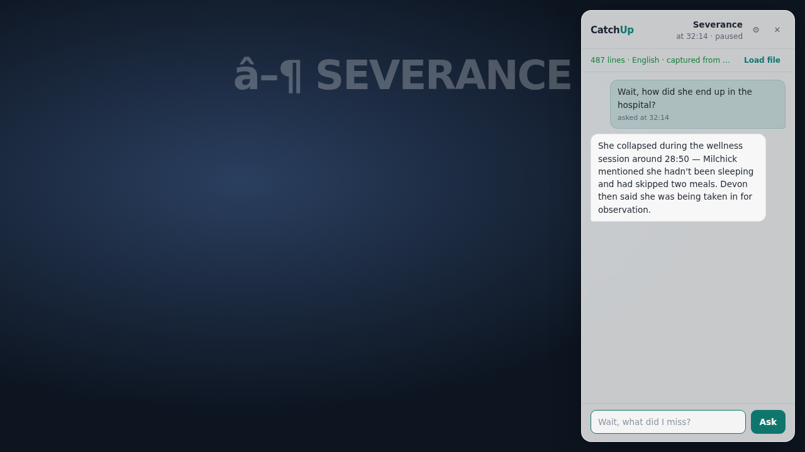

# CatchUp

[](https://github.com/cochoe-sudo/catchup/actions/workflows/ci.yml)

Spoiler-safe Q&A Chrome extension for streaming video. Missed something while
watching? Click the toolbar icon, ask in the sidebar — CatchUp answers using
**only the dialogue up to your current timestamp**, never anything after it.

Works on **any site with an HTML5 video player**; YouTube and Netflix get
dedicated subtitle capture.



**Why this exists:** asking your phone "wait, why is she in the hospital?"
gets you a wiki answer full of spoilers. CatchUp builds its knowledge from the
video's own subtitles, hard-truncated at your playback position — the model
literally cannot see what happens next.

## How it works

1. **Click the CatchUp toolbar icon** on any video page: a translucent
   frosted-glass sidebar slides over the page (Shadow DOM, so site styles
   can't touch it; it follows the video into fullscreen).
2. **Subtitles are captured automatically.** On YouTube, a page-world script
   reads the player's caption track list and fetches the best track as WebVTT.
   On Netflix, it hooks `JSON.parse` to catch the play manifest (the Subadub
   technique) and fetches the WebVTT subtitle track the player already uses.
   Everywhere else, a generic script combines two strategies: it harvests the
   player's native HTML5 `textTracks` (nudging disabled tracks to "hidden" so
   their cues load), and it hooks `fetch`/`XMLHttpRequest` to capture the
   WebVTT/TTML subtitle segments that custom-caption players (HBO Max, Hulu,
   Disney+, …) download themselves — segments merge into one transcript as
   playback progresses. Captured subtitles are stored per video, so switching
   episodes just works. Manual `.srt`/`.vtt` loading remains as an
   override/fallback.
3. When you ask, the sidebar reads the video's **live** `currentTime` straight
   from the page and the background truncates this video's subtitles to cues
   with `start <= currentTime` — on **every** question, so seeking
   forward/backward mid-conversation is always handled.
4. The truncated transcript goes to your chosen answer engine — **Google
   Gemini** (`gemini-2.5-flash`, free tier) or **Anthropic Claude**
   (`claude-sonnet-4-6`, paid) — with a system prompt that strictly forbids
   outside knowledge of the show; if the answer isn't in the transcript, it
   says so instead of guessing.

Everything runs client-side. Your API key lives in `chrome.storage.local` and
is sent only to the selected provider's API.

**Free usage:** pick Gemini in the options page and create a key at
[aistudio.google.com/apikey](https://aistudio.google.com/apikey) — the free
tier needs no payment method and its daily quota covers normal viewing
easily.

## Setup

```sh
npm install
npm run build     # typecheck + bundle to dist/
```

Then in Chrome:

1. Open `chrome://extensions`, enable **Developer mode**.
2. **Load unpacked** → select the `dist/` folder.
3. Right-click the CatchUp icon → **Options** (or click ⚙ in the sidebar) →
   pick a provider and paste its API key (Gemini for free usage, Anthropic if
   you have credits).
4. Open any video, click the CatchUp icon to open the sidebar, and ask —
   subtitles are captured automatically a few seconds after playback starts
   (watch the sidebar status line). Load an `.srt`/`.vtt` manually only if
   capture fails. No tab refresh needed after installing or updating the
   extension — it injects itself into open tabs.

## Development

```sh
npm run dev          # rebuild on change (reload the extension to pick up)
npm test             # unit tests (subtitle parser + truncation logic)
```

## Testing

The spoiler boundary is the product, so it's tested at three levels:

- **Unit** (`npm test`, Vitest): 44 tests over the SRT/VTT/TTML parsers
  (timestamp formats incl. TTML ticks/frames/offsets, CRLF/BOM, voice tags,
  entities, malformed blocks) and the truncation logic (exact-boundary
  inclusion, 1ms-after exclusion, backward seeks, unsorted input,
  NaN/negative times).
- **Bundle smoke** (`node scripts/smoke.mjs`): loads the *built* service
  worker in Node with a chrome stub and drives the message handler through
  every non-network path (key/subtitle gates, cue-payload sanitization,
  per-video lookup precedence).
- **Browser end-to-end** (`node scripts/browser-smoke.mjs`): loads the
  unpacked extension into headless Chromium and serves two mock streaming
  sites — one with a native `<track>`, one that downloads VTT segments
  itself via fetch/XHR like HBO Max — verifying the real flow: auto-capture
  (both strategies) → per-video storage → sidebar toggle → ask →
  truncated-transcript answer, without needing an API key or external
  network.

## Project layout

```
public/manifest.json      MV3 manifest
src/lib/subtitles.ts      SRT/VTT/TTML → timestamped cues (lenient, tag-stripping)
src/lib/truncate.ts       spoiler boundary: cues with start <= currentTime
src/lib/prompt.ts         spoiler-safety system prompt
src/lib/messages.ts       typed message contracts + storage keys
src/background/           service worker: storage, truncation, Claude/Gemini calls,
                          icon-click toggle, install-time tab injection
src/content/              sidebar UI + video/title detection + subtitle relay
                          (no runtime imports — MV3 rule)
src/page/                 MAIN-world capture: YouTube, Netflix, generic textTracks
src/options/              provider + API key entry
tests/                    vitest suites for parser + truncation
```

## Known MVP limitations (deliberate)

- Auto-capture prefers English tracks; other languages fall back to the first
  usable track. Manual loading always wins for the current video.
- On custom-caption sites (HBO Max and similar), subtitles are sniffed from
  the player's own downloads, which usually happen only while **captions are
  turned ON** in the player, and only for the parts of the video the player
  has buffered — start captions early for the fullest transcript. Sites that
  encrypt or embed subtitles in the media stream itself won't auto-capture;
  manual loading still works there.
- The last 8 videos' subtitles are kept (LRU); the full truncated transcript
  is sent on each question (no windowing/summarization yet).
- No audio fingerprinting, no multi-episode memory, no accounts.

## License

MIT — see [LICENSE](LICENSE).
